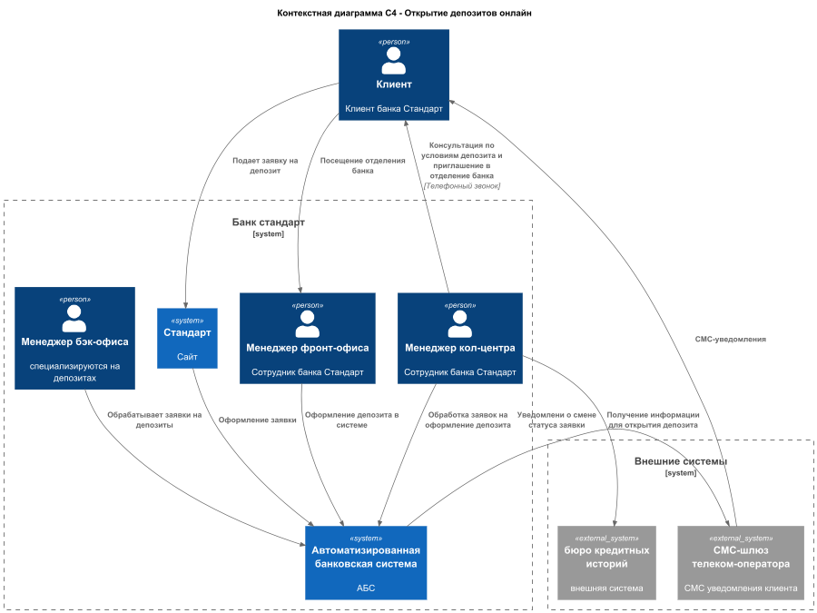
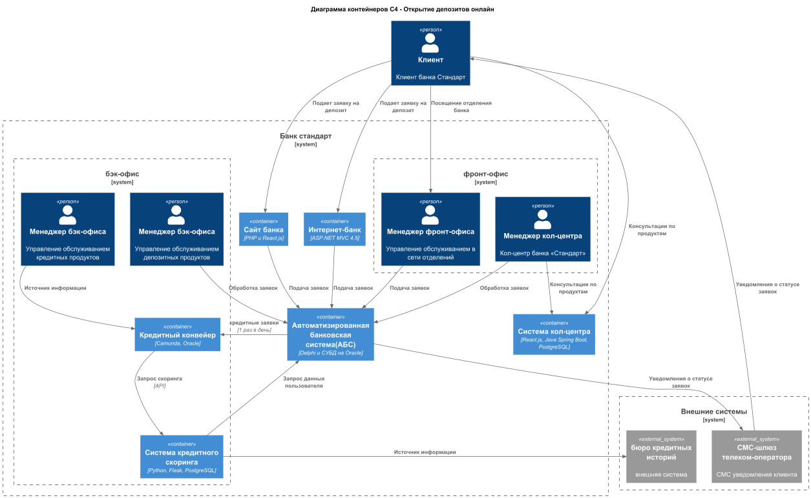
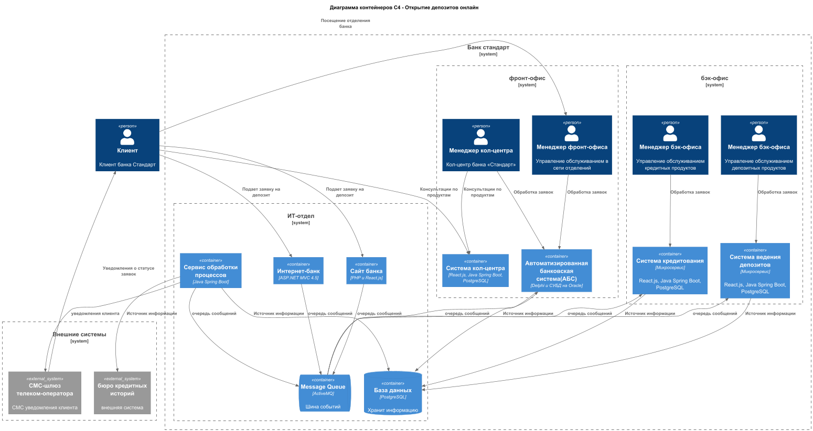

### **Функциональные требования**
Опишите здесь верхнеуровневые Use Cases. Их нужно оформить в виде таблицы с пошаговым описанием:

| **№** | **Действующие лица или системы** | **Use Case**                                     | **Описание**                                                                                                                                                                                                                                                                                                           |
|:-----:|:---------------------------------|:-------------------------------------------------|:-----------------------------------------------------------------------------------------------------------------------------------------------------------------------------------------------------------------------------------------------------------------------------------------------------------------------|
|  1.   | Клиент                           | подача заявки на депозит                         | 1. Авторизуется в интернет-банке 2. Просматривает доступные депозиты с персонализированными ставками 3. Выбирает депозит, указывает счет и сумму 4. Подтверждает операцию СМС-кодом 5. Отправляет заявку 6. Получает уведомление о принятии заявки                                                      |
|  2.   | Клиент                           | подача заявки на депозит                         | 1. зайти на сайт банка 2. Выбирает депозит, просматривает предложения по ставкам 3. В форме указывает номер телефона и Ф. И. О. 4. Подтверждает операцию СМС-кодом 5. Отправляет заявку 6. Ожидает звонка от менеджера банка                                                                            |
|  3.   | менеджер в бэк-офисе             | обработка заявки на открытие депозита            | 1. Получает уведомление о новой заявке на депозит 2. Изучает заявку в системе кол-центра 3. Звонит клиенту 4. Предлагает условия депозита (возможно, особые) 5. Назначает встречу в отделении для идентификации                                                                                            |
|  4.   | клиент                           | СМС-уведомления                                  | после подтверждения размера ставки и открытия депозита.                                                                                                                                                                                                                                                                |
|  5.   | клиент                           | подача заявки на кредит                          | 1. Авторизуется в интернет-банке или зайти на сайт 2. Выбирает кредит, просматривает ставки по кредитам 3. Нажимает кнопку перезвонить или указывает номер телефона и Ф. И. О. 4. Подтверждает операцию СМС-кодом 5. Отправляет заявку 6. Получает уведомление о необходимости прийти в отделение банка |
|  6.   | новый клиент                     | предложение открыть кредит по некоторой ставке   | 1. зайти на сайт банка 2. Выбирает кредит, просматривает предложения по ставкам                                                                                                                                                                                                                                     |
|  7.   | клиент                           | СМС-уведомления                                  | информирование о том, что нужно прийти в отделение для получения кредита и идентификации                                                                                                                                                                                                                               |
|  8.   | менеджер                         | подача заявки на кредит                          | 1. Проводит личную идентификацию клиента 2. Оформляет заявку в АБС банка 3. сообщает клиенту, что его заявка будет рассмотрена банком.                                                                                                                                                                           |
|  9.   | клиент                           | Получение персонализированных ставок по кредитам | 1. подает заявку на кредит на сайте или в интернет-банке 2. Ожидает звонка менеджера по персональному предложению                                                                                                                                                                                                   |
|  10.  | клиент                           | СМС-уведомления                                  | изменении статуса заявки на кредит                                                                                                                                                                                                                                                                                     |
|       |                                  |                                                  |                                                                                                                                                                                                                                                                                                                        |

### **Нефункциональные требования**
Опишите здесь нефункциональные требования и архитектурно значимые требования.

| **№** | **Требование**                                                                                                        |
|:-----:|:----------------------------------------------------------------------------------------------------------------------|
|  1.   | быстрая загрузка справочных данных, менее секунды                                                                     |
|  2.   | сервисы должны работать 24/7 и быть доступны в 99,9% случаев                                                          |
|  3.   | У банка есть резервный ЦОД, в случае сбоя можно переключиться на него                                                 |
|  4.   | предусмотреть равномерное горизонтальное масштабирование и распределение запросов между серверами, приложениями и ЦОД |
|  5.   | Данные необходимо защищать с помощью механизма шифрования трафика.                                                    |
|  6.   | Команда АБС утверждает, что база данных системы уже перегружена.                                                      |
|  7.   | использовать технологии, которые уже есть в банке (MS SQL, Oracle)                                                    |
|  8.   | нужно предусмотреть разработку документации для дальнейшего расширения системы.                                       |
|  9.   | сотрудники депозитов и сотрудники кредитов не должны иметь доступа к данным друг друга по требованиям безопасности    |

### **Решение**
Приведите диаграммы контекста и контейнеров в модели C4. Опишите там основные компоненты и интеграции всех элементов решения. 

**Сайт** — подача заявки на депозит
В ближайшей перспективе компания хочет, чтобы подать заявку на депозит можно было и на сайте. Когда потенциальный клиент отправит заявку, с ним свяжется менеджер из кол-центра и расскажет об условиях по депозиту.

Банк хочет реализовать механику, когда заявку на кредит можно подать сразу с сайта. Но нужно учитывать, что на этом этапе о клиенте ещё ничего не известно, и вся информация о нём есть только в бюро кредитных историй.

**Оформеления заявок через сайт**
- отображение на сайте основной информации кредитования
- добавлена заявка онлайн для сайта
- отображение в личном кабинете пользователя персональных предложений по кредитам
- добавлена заявка онлайн для интернет банка

[Диаграмма контекста оформления заявки на депозит](context_diagram.puml)

[Диаграмма контейнеров оформления заявки на депозит](container_diagram.puml)

**Ускорение взаимодействия межмодульного взаимодействия**
- реализация очереди сообщений
- общая база данных
- реализация микросервисов с разделением взаимеодейсвия по отделам

[Диаграмма контейнеров оформления заявки на депозит микросервисы](container_diagram_solution.puml)

### **Альтернативы**
Опишите здесь наиболее важные альтернативные решения.
1. Интеграция сайта с системой АБС
2. Обновление сайта на новый стек
3. Переход на готовое коробочное решение

**Недостатки**
- Увеличение количества модулей - повешает нагрузку на ее обслуживание
- Обучение команды при переходе на новый стек

**ограничения**
- перегруженная АБС при интеграции новых систем
- текущая передача данных 1 раз в сутки
- Клиент может подать заявку на открытие депозита только в отделении

**риски**
- производительность, может проседать при отключении одной или нескольких систем
- безопасность, необходимо разграничить взаимодействия по отделам
- масштабирование, при увеличении числа клиентов и запросов 

Подробно опишите здесь недостатки, ограничения и риски выбранного решения.

