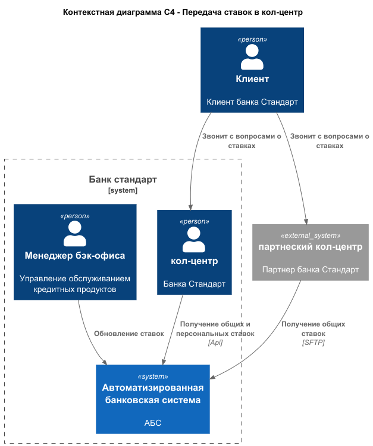
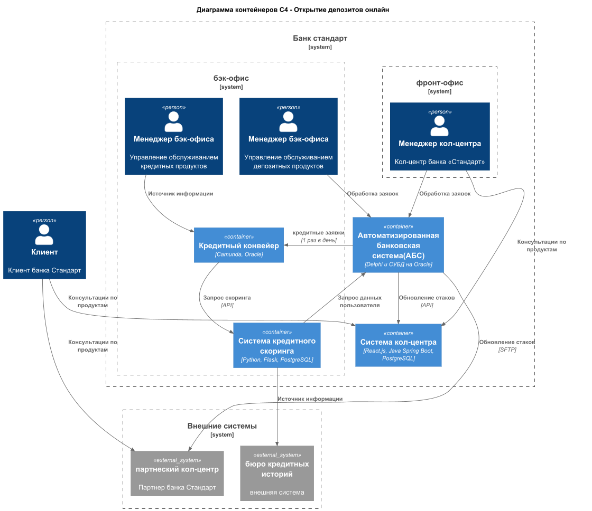

### предоставить системе кол-центра доступ к ставкам по депозитам

### **Функциональные требования**
Опишите здесь верхнеуровневые Use Cases. Их нужно оформить в виде таблицы с пошаговым описанием:

| **№** | **Действующие лица или системы**        | **Use Case**                       | **Описание**                                                                                                                                                                                                                                                 |
|:-----:|:----------------------------------------|:-----------------------------------|:-------------------------------------------------------------------------------------------------------------------------------------------------------------------------------------------------------------------------------------------------------------|
|  1.   | Сотрудник кол-центра                    | Консультация по актуальным ставкам | 1. Клиент звонит в кол-центр с вопросом о ставках 2. Сотрудник открывает систему кол-центра 3. Система отображает актуальные ставки 4. Сотрудник консультирует клиента по условиям                                                                  |
|  2.   | Сотрудник партнёрского кол-центра       | Консультация по актуальным ставкам | 1. Клиент звонит в партнёрский кол-центр 2. Сотрудник открывает систему кол-центра партнёра 3. Система отображает актуальные ставки 4. Сотрудник консультирует клиента по условиям                                                                  |
|  3.   | Система кредитного скоринга             | Обновление ставок в кол-центрах    | 1. Сотрудник отдела кредитования обновляет ставки 2. Система автоматически передаёт обновления в систему кол-центра банка через API 3. Система формирует файл со ставками для партнёрского кол-центра 4. Файл передаётся по SFTP в систему партнёра |
|  4.   | Менеджер бэк-офиса депозитных продуктов | Управление ставками депозитов      | 1. Менеджер работает запрашивает ставки из системы кредитного скоринга 2. Обновляет ставки в АБС 3. Система формирует файл со ставками для партнёрского кол-центра 4. Файл передаётся по SFTP в систему партнёра                                    |

### **Нефункциональные требования**
Опишите здесь нефункциональные требования и архитектурно значимые требования.

| **№** | **Требование**                                                                                                                                                                 |
|:-----:|:-------------------------------------------------------------------------------------------------------------------------------------------------------------------------------|
|  1.   | Нужно, чтобы сотрудники кол-центра могли проконсультировать клиентов хотя бы по текущим ставкам банка                                                                          |
|  2.   | необходимо подключить к работе партнёрский кол-центр, чтобы также могли проконсультировать клиентов по актуальным депозитным ставкам                                           |
|  3.   | нужно наладить процесс передачи информации об актуальных ставках между банком и кол-центром                                                                                    |
|  4.   | Кол-центр партнёра готовы получать актуальные ставки в виде файлов, через SFTP-протокол                                                                                        |

### **Решение**
- ставки обновляются раз в день - значит действительны в течении дня
- добавить отправку раз в сутки текущих общих ставок партнерскому call-центру по SFTP
- добавить API в АБС для запросов call-центра банка по общим и персональным ставкам

[Диаграма контекста](context_diagram.puml)

[Диаграма контецйнеров](container_diagram.puml)

### **Альтернативы**

1. интеграция call-центров с БД АБС:
2. вынос отдельного модуля для информирования call-центров по ставкам
3. рассылка ставок по email

**Недостатки**
- дополнительная нагрузка на систему АБС
- безопасность персональных данных
- дублирование логики
- зависимость от центральной системы

**ограничения**
- ограничения производительности по количеству запросов
- ограничения по безопасности данных

**риски**
- недоступность системы АБС
- задержки в обновлении рассылки ставок
- превышение времени разработки
