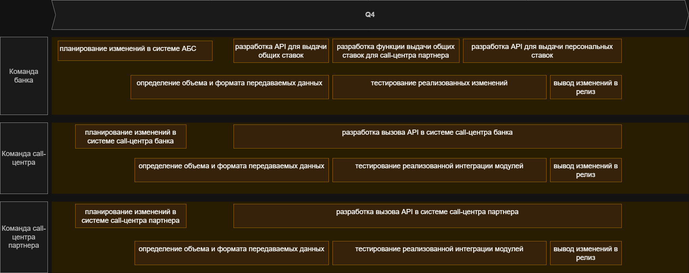

# Список крупных задач для каждой системы

## 1. добавить отправку раз в сутки текущих общих ставок партнерскому call-центру по SFTP
- планирование изменений в системе АБС
- планирование изменений в системе call-центра банка
- определение объема и формата передаваемых данных
- разработка API для выдачи общих ставок
- разработка API для выдачи персональных ставок
- тестирование реализованных изменений
- разработка вызова API в системе call-центра банка
- тестирование реализованной интеграции модулей
- вывод изменений в релиз

## 2. добавить API в АБС для запросов call-центра банка по общим и персональным ставкам
- планирование изменений в системе АБС
- планирование изменений в системе call-центра партнера
- определение объема и формата передаваемых данных
- разработка функции выдачи общих ставок для call-центра партнера
- тестирование реализованных изменений
- разработка вызова API в системе call-центра партнера
- тестирование реализованной интеграции модулей
- вывод изменений в релиз

## планируемое время разработки 1-2 месяца

[RoadMap.drawio](RoadMap.drawio)

