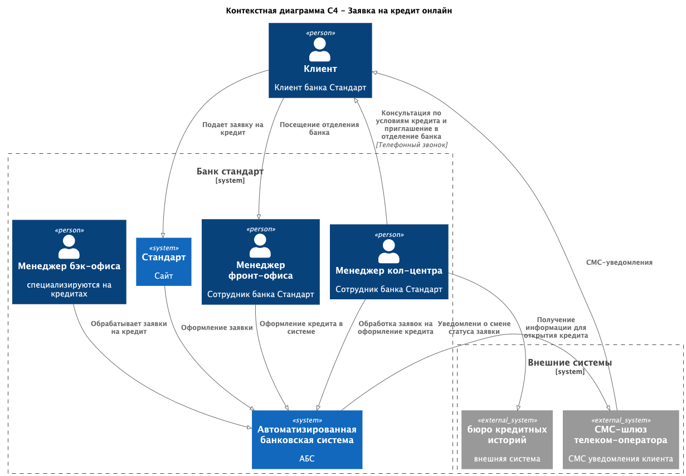
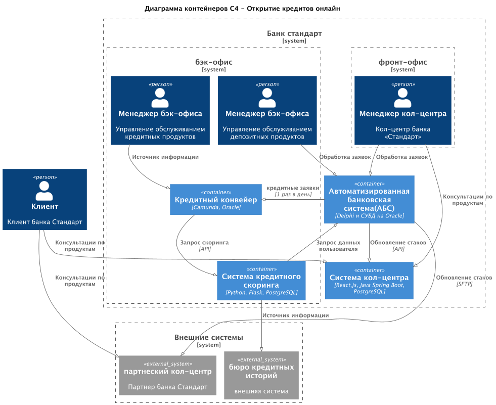
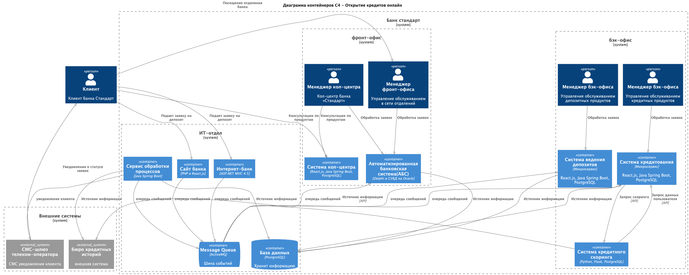

### **Функциональные требования**

| **№** | **Действующие лица или системы** | **Use Case**                                    | **Описание**                                                                                                                                                                                                                                                                                 |
|-------|----------------------------------|-------------------------------------------------|:---------------------------------------------------------------------------------------------------------------------------------------------------------------------------------------------------------------------------------------------------------------------------------------------|
| 1     | Клиент                           | подача заявки на кредит                         | 1. зайти на сайт банка 2. Выбирает кредит, просматривает предложения по ставкам 3. В форме указывает номер телефона и Ф. И. О. 4. Подтверждает операцию СМС-кодом 5. Отправляет заявку 6. Ожидает звонка от менеджера банка                                                   |
| 2     | Клиент                           | подача заявки на кредит                         | 1. Авторизуется в интернет-банке 2. Просматривает доступные кредитные предложения с персонализированными ставками 3. Выбирает кредитное предложение, указывает счет и сумму 4. Подтверждает операцию СМС-кодом 5. Отправляет заявку 6. Получает уведомление о принятии заявки |
| 3     | менеджер в call-центра           | обработка заявки на кредит                      | 1. Получает уведомление о новой заявке на кредит 2. Изучает заявку в системе call-центра 3. Звонит клиенту 4. Предлагает условия кредита (возможно, особые) 5. Назначает встречу в отделении для идентификации                                                                   |
| 3     | менеджер в бэк-офисе             | обработка заявки на кредит                      | 1. Получает уведомление о новой заявке на кредит 2. Изучает заявку в системе кредитного сервиса с подгруженной историей кредитов и кредитов 3. Принимает решение об одобрении кредита и/или персональным предложениям                                                               |
| 4     | клиент                           | СМС-уведомления                                 | после подтверждения размера ставки и открытия кредита.                                                                                                                                                                                                                                       |

### **Нефункциональные требования**

| **№** | **Требование**                                                                                                        |
|-------|-----------------------------------------------------------------------------------------------------------------------|
| 1     | быстрая загрузка справочных данных, менее секунды                                                                     |
| 2     | сервисы должны работать 24/7 и быть доступны в 99,9% случаев                                                          |
| 3     | У банка есть резервный ЦОД, в случае сбоя можно переключиться на него                                                 |
| 4     | предусмотреть равномерное горизонтальное масштабирование и распределение запросов между серверами, приложениями и ЦОД |
| 5     | Данные необходимо защищать с помощью механизма шифрования трафика.                                                    |
| 6     | Команда АБС утверждает, что база данных системы уже перегружена.                                                      |
| 7     | использовать технологии, которые уже есть в банке (MS SQL, Oracle)                                                    |
| 8     | нужно предусмотреть разработку документации для дальнейшего расширения системы.                                       |
| 9     | сотрудники кредитов и сотрудники кредитов не должны иметь доступа к данным друг друга по требованиям безопасности     |

### **Решение**

**Сайт** — подача заявки на кредит
Решено, что кредитный процесс с подачей заявки онлайн надо сделать в рамках одного года после MVP.
Нужно учитывать, что на этом этапе о клиенте ещё ничего не известно, и вся информация о нём есть только в бюро кредитных историй.

**Оформеления заявок через сайт и интернет банк**
- отображение на сайте основной информации кредитования
- добавлена заявка онлайн для сайта
- отображение в личном кабинете пользователя персональных предложений по кредитам
- добавлена заявка онлайн для интернет банка
- В качестве источников данных для скоринга используется API бюро кредитных историй
- в АБС хранятся данные о клиентах, внутренняя история оплаты кредитов от клиента, платежи по кредиту
- в Кредитном конвейере хринится информация о номерах платежей к кредитному договору

[Диаграмма контекста оформления заявки на кредит](context_diagram.puml)

текущая схема обрабатывает заявки раз день:
[Диаграмма контейнеров оформления заявки на кредит](container_diagram.puml)

**на начальном этапе процесс повторяет текущие этапы с добавлением электронной подачи заявки клиентом**
1. Клиент отправляет заявку на открытие кредита через сайт, интернет банк, обращение через колл-центр или первичного посещения отделения банка
2. Новому клиенту через колл-центр предлагают прийти в отделение банка для идентификации
3. Заявка передаётся в систему АБС
4. Через интеграцию по БД раз в день передаются в Кредитный конвейер
5. Менеджеры отдела кредитования работают в Кредитном конвейере и изучают детали заявки
6. данные в скоринг передаются из БД других систем раз в сутки
7. запросы к бюро кредитных историй происходят сразу онлайн в момент скоринга заявки
8. На основании оценки для клиента, который возвращает система скоринга и параметров кредитной заявки, происходит решение о выдаче кредита сотрудником
9. При одобрении кредита заявки переходят в финальный статус и потом раз в сутки эта информация передается в АБС
10. в АБС проводятся платежи для зачисления кредитных средств на счет клиента
11. уведомление клиента по смс

**Недостатки**
- ожидание клиента всех этапов может занимать недели
- ручная обработка заявки на всех этапах

**ограничения**
- уже перегруженная система АБС
- данные по заявке клиента передаются в Кредитный конвейер раз в день  
- данные в скоринг из БД других систем передаются раз в сутки

**риски**
- При ручной обработке заявок возможны возможны ошибки из-за человеческого фактора
- безопасность, необходимо разграничить взаимодействия по отделам
- масштабирование, только за счет привлечения дополнительных сотрудников бэк-офиса при увеличении числа клиентов и запросов

**Ускорение взаимодействия межмодульного взаимодействия**
- реализация очереди сообщений
- общая база данных
- реализация микросервисов с разделением взаимеодейсвия по отделам
- функции кредитного конвейера реализуются в виде микросервиса кредитования, где обработка заявок переходит от ручной к автоматической, начиная с типовых  
- Система кредитного скоринга остается отдельным компонентом, разрабатываемым сотрудниками ИТ-отдела
- Сервис обработки процессов содержит функции мониторинга процессов ит отделом
- добавлена система предодобренных предложений по кредитам, которая через ночной пересчет готовит персональные предложения
- ожидается что минимальное время исполнения заявок может сократиться до нескольких минут

[Диаграмма контейнеров оформления заявки на кредит микросервисы](container_diagram_solution.puml)

1. клиент формирует заявку на сайте, интернет банке, через сотрудника фронт-офиса или колл-центра
2. заявки от сайта, интернет банка, сотрудника фронт-офиса или колл-центра поступают в систему АБС
3. система АБС сохраняет детали заявки в общую базу данных и отправляет в очередь событий группы заявок с параметрами раз в минуту
4. также Система АБС раз в сутки формирует группу заявок на предодобрение кредитов в режиме "ночной пересчет"
5. кредитный микросервис слушает очередь событий и обрабатывает заявки
6. кредитный микросервис формирует запросы в скоринг через API
7. скоринг формирует запросы к бюро кредитных историй через API
8. скоринг использует внутренний сервис машинного обучения, где на основании модели и полученных данных выдается итоговый скоринг
9. если скоринг не прошел кредитный микросервис отклоняет заявку с описанием технической информации
10. сотрудник кредитного отдела мониторят процессы обработки заявок в кредитном сервисе
11. сотрудник кредитного отдела подтверждают результат обработки скоринга
12. кредитный микросервис обновляет финальный статус заявки в общей базе данных и отправляет в очередь событий
13. система АБС слушает очередь событий и для подтвержденных заявок на крредит производит платежи для зачисления кредитных средств на счет клиента
14. система АБС слушает очередь событий и для отклоненных заявок формирует уведомление для клиента
14. система АБС слушает очередь событий и для предодобренных кредитов формирует предложение для клиента
15. система АБС формирует уведомления клиента по смс

**Недостатки**
- Увеличение количества модулей - повешает нагрузку на ее обслуживание
- при переходе на новый стек возможны задержки обращений до разрешения возникших блокировок
- Обучение команды при переходе на новый стек

**ограничения**
- перегруженная АБС при интеграции новых систем

**риски**
- При неоднозначных параметрах заявка обрабатывается вручную, что может увеличить срок ожидания
- безопасность, необходимо разграничить взаимодействия по отделам
- безопасность, необходимо шифровать данные в общей БД с доступом на чтение только целевому сервису
- масштабирование, при увеличении числа клиентов и запросов возможно поднять дополнительные ноды сервисов и БД
- производительность, может проседать при отключении одной или нескольких систем

### **Альтернативы**

#### 1. всё оставляем в АБС, увеличиваем штат сотрудников бэк-офиса

**Недостатки**
- ожидание клиента всех этапов может занимать недели
- ручная обработка заявки на всех этапах

**ограничения**
- уже перегруженная система АБС
- потолок роста количества заявок в день ограниченный штатом сотрудников

**риски**
- При ручной обработке заявок возможны возможны ошибки из-за человеческого фактора
- безопасность, необходимо разграничить взаимодействия по отделам
- масштабирование, только за счет привлечения дополнительных сотрудников бэк-офиса при увеличении числа клиентов и запросов

#### 2. Интеграция сайта с системой АБС

**Недостатки**
- усложнение системы АБС для выдачи страниц сайта
- ожидание клиента всех этапов может занимать недели
- ручная обработка заявки на всех этапах
- Увеличение количества модулей - повешает нагрузку на ее обслуживание
- необходимость настройки в АБС разграничения доступов к данным

**ограничения**
- перегруженная АБС при интеграции новых систем

**риски**
- При ручной обработке заявок возможны возможны ошибки из-за человеческого фактора
- безопасность, необходимо разграничить взаимодействия по отделам
- масштабирование, только за счет привлечения дополнительных сотрудников бэк-офиса при увеличении числа клиентов и запросов

#### 3. Переход на готовое коробочное решение

**Недостатки**
- Обучение команды при переходе на новый стек
- стоимость перехода и поддержки может быть больше чем модернизация силами текущей командой

**ограничения**
- новые ограничения связанные с новой системой, возможно неявные обнаруживаемые уже в процессе эксплуатации

**риски**
- новые решения по безопасности
- возможное отсутствие решений по масштабированию или его ограничение техническое или в рамках лицензии
- полное переобучение сотрудников
- производительность, может не соответствовать текущей нагрузке
